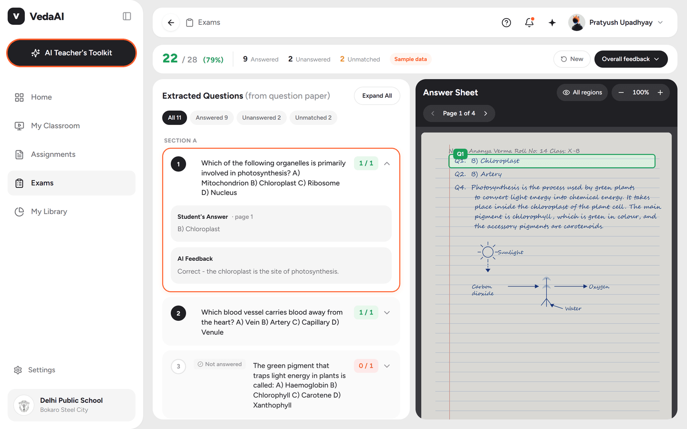
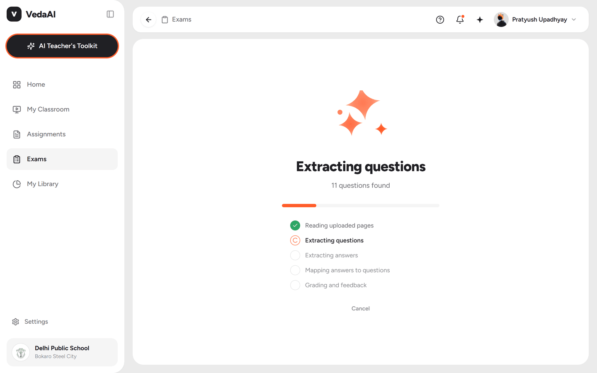
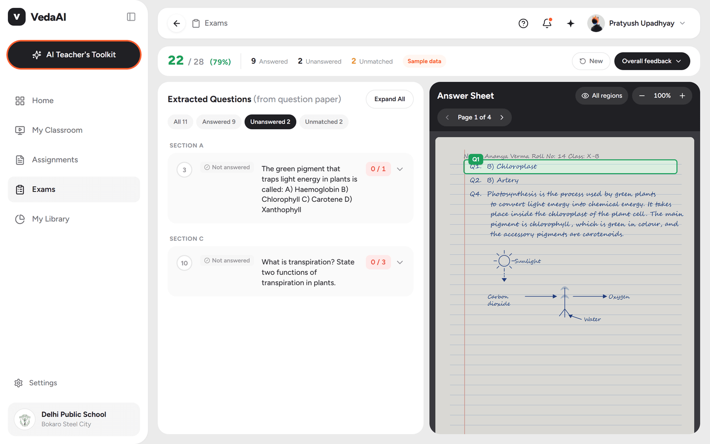
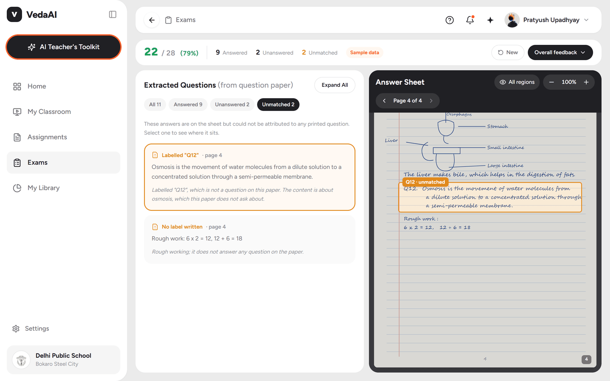
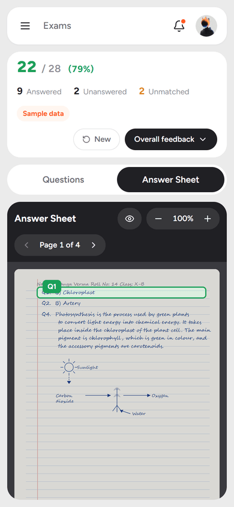

# VedaAI — AI Assessment Extraction & Answer Mapping

A teacher uploads a question paper and one student's handwritten answer sheet. The app
extracts every question in printed order, transcribes the answers, maps each answer to
its question, grades it, and **highlights the exact region of the sheet** where that
answer sits.



| | |
| --- | --- |
| **Live URL** | **https://vedaai-assessment-rose.vercel.app** |
| **Repository** | https://github.com/aayusharmaaa/vedaai-assessment |
| **AI model** | Google Gemini (free tier), tried in order: `gemini-3.6-flash` → `gemini-3.5-flash` → `gemini-flash-lite-latest` |
| **Stack** | Next.js 15 · TypeScript · Tailwind v4 · no database, no auth |

---

## Quick start

```bash
npm install
```

Put a [Google AI Studio](https://aistudio.google.com/apikey) key into `.env.local`:

```bash
GEMINI_API_KEY=your_key_here
GEMINI_API_KEY_2=optional_second_key
```

```bash
npm run dev
```

Open http://localhost:3000. **No key is required to evaluate it** — the *worked sample*
button walks the entire pipeline on bundled data with zero API calls.

| Command | What it does |
| --- | --- |
| `npm run dev` | Dev server |
| `npm run build` | Production build |
| `npm run build:check` | Build into a throwaway dir (safe while `dev` is running) |
| `npm test` | 33 tests — mapping, extraction and API failover |
| `npm run sample` | Regenerate the bundled sample paper, sheet and result |

---

## The flow

**1 · Upload** — both files, PDF or images, multi-page, with client-side validation.


**2 · Processing** — five named stages with real per-page progress, not a fake spinner.



**3 · Review** — click any question to highlight its answer on the sheet. Filters answer
the brief's core question directly: *which questions were left unanswered?*



**4 · Unmatched answers** — work on the sheet that answers nothing on the paper is
surfaced with a plain-English reason and highlighted amber, not silently dropped.



**Responsive** — two panels on desktop, a tab switcher on mobile.



---

## Approach

```
Question Extraction → Answer Extraction → Answer Mapping → Grading/Feedback
```

Each stage is its own small API route, so payloads stay well under serverless body
limits and progress is honest per page.

### 0 · Rasterisation (browser)

`pdf.js` renders every uploaded page — PDF or image — to a canvas at a 1600px long edge.
**The same bitmap feeds both the model and the on-screen viewer.** That is what keeps
highlighting honest: the coordinates the model returns are relative to exactly the image
the teacher is looking at, so no coordinate-space translation can drift. Nothing is
written to disk or a database.

### 1 · Question extraction

Pages go up in one call (chunked at 3 for longer papers, with the previous chunk's last
number as context). The prompt is strict about the things being evaluated:

- The printed number is preserved **verbatim** — `11 (a)` stays `11 (a)`, never renumbered.
- **Labelled sub-parts become separate entries.** Where they share a stem, the stem is
  repeated into each so every entry reads on its own.
- A sub-part always carries its parent number. A paper printing `7. (a)` then a bare
  `(b)` would otherwise yield the number `(b)`, which identifies nothing — so
  `qualifySubPart` repairs it in code rather than relying on the model to remember.
- Printed order is captured as an explicit `order` index, which drives display order
  regardless of the order the student answered in.

### 2 · Answer extraction

**One request per page.** Deliberate: bounding-box accuracy degrades noticeably when a
model is asked to localise across several images at once, and per-page calls give the
teacher real progress. Each call receives the tail of the previous page's last answer so
continuations can be detected.

Boxes are requested in Gemini's native `box_2d` format — `[ymin, xmin, ymax, xmax]`
normalised to 0–1000 — because asking for the format the model was trained on is
measurably more reliable than inventing one. They are converted to normalised 0–1 rects,
which survive zoom and responsive layout without recomputation.

### 3 · Answer mapping — deterministic first

The part most worth getting right, so it is **not** left to the model alone.

**Pass 1 (code, `mapping.ts`)** — match on the label the student actually wrote, in
descending order of trust:

1. Exact normalised label — `Q.11 (a)` and `11(A)` both reduce to `11a`.
2. Same number, sub-part written differently — a paper printing `(ii)` matches `(b)`.
3. A bare number against a question with no sub-parts.
4. A bare parent number answering all of its sub-parts in one block — attributed to each
   rather than dropped.

**Pass 2 (model)** — only what pass 1 could not resolve goes to a text-only semantic
call, scored with a confidence. Most papers never pay for this call. The result is
re-validated in code: a semantic match is rejected if it targets an already-answered
question.

Continuations are stitched **before** matching, so an answer spanning a page break
becomes one answer owning **two regions** — which is what lets it highlight on both.

### 4 · Grading and feedback

Answered questions are graded in batches of 10, with partial credit, per-question
feedback addressed to the student, and an overall teacher's summary. A failed batch
leaves those questions ungraded rather than sinking the run.

---

## Accuracy

Measured on the **deployed app**, using the bundled sample as ground truth (the sample
is generated with known-correct boxes, so this is a genuine comparison rather than a
vibe check). 7 model calls, ~17k tokens, 56 seconds:

```
1.       answered   label     pages=[1]     1/1
2.       answered   label     pages=[1]     1/1
3.       unanswered none      pages=[]      0/1   <- correctly skipped
4.       answered   label     pages=[1,2]   3/3   <- spans two pages
5.       answered   label     pages=[2]     1.5/3 <- partial credit
6.       answered   label     pages=[2]     3/3   <- answered before Q5
7 (a)    answered   label     pages=[3]     3/3   <- sub-parts kept separate
7 (b)    answered   label     pages=[3]     2/2
8.       answered   label     pages=[4]     5/5
9.       answered   label     pages=[3]     3/3
10.      unanswered none      pages=[]      0/3   <- correctly skipped
UNMATCHED: "Q12." | no label (rough work)
```

**11/11 questions** in printed order, every mapping resolved by label, both unanswered
questions flagged, both stray answers caught. Highlight accuracy on multi-line answers
measured **IoU 0.73–0.87** against ground-truth boxes.

---

## Edge cases

| Requirement | How it is handled | Where |
| --- | --- | --- |
| Sub-parts as separate questions | Prompt rule + `parentNumber`; a bare `(b)` is repaired to `7 (b)` in code | `prompts.ts`, `normalize.ts` |
| Original numbering preserved | `number` is verbatim; `order` is separate and drives display | `types.ts`, `normalize.ts` |
| Answered out of order | Label matching is order-independent; display follows printed `order` | `mapping.ts` |
| Unanswered questions | Every question gets a row; no answer means 0 marks, a "Not answered" badge and a dedicated filter | `mapping.ts`, `QuestionList.tsx` |
| Answers matching no question | **Unmatched** tab with a plain-English reason, highlighted amber | `mapping.ts`, `AnswerViewer.tsx` |
| Answers spanning pages | Continuations stitched into one answer with multiple regions; the second page's chip reads "continued" | `mapping.ts`, `AnswerViewer.tsx` |
| Attempted but left blank | Distinguished from never-attempted as `blank` — a different signal for a teacher | `normalize.ts`, `mapping.ts` |
| Mislabelled answers | The semantic pass rescues them; the card shows "Matched by content" | `analyze/route.ts` |
| Malformed model output | Every field coerced and clamped; degenerate boxes dropped; JSON parsed tolerantly | `normalize.ts`, `gemini.ts` |
| Exhausted quota, 5xx, timeouts | Walks a (model x key) grid; see [Reliability](#reliability) | `gemini.ts` |

**33 tests** (`npm test`) pin these. They have earned their keep three times:

- `\bq\b` never matches in `"q3"` (both are word characters), so every `Q`-prefixed
  label survived unstripped — which would have broken mapping on any paper printing "Q1".
- A live run revealed page-spanning answers were broken **by the prompt itself**: it
  required a continuation to "begin mid-sentence", but the real one began a fresh
  sentence, so the model correctly returned `false` and half the answer was dropped and
  then reported as unmatched.
- The same run showed a bare `(b)` sub-part number falling through to the slower
  semantic matcher instead of matching by label.

---

## Reliability

Free-tier quota is metered **per project, per model** — 20 requests per day. One 6-page
assessment costs 7 requests. So the client walks a **(model x key) grid** rather than
hammering one pair:

```
gemini-3.6-flash + key1  ->  gemini-3.6-flash + key2     (same model, next key)
     | only once every key is spent
     v
gemini-3.5-flash + key1  ->  gemini-3.5-flash + key2
     |
     v
gemini-flash-lite-latest + key1 -> ...
```

Every key is tried on the **best** model before dropping to a weaker one, so quality is
preserved for as long as any quota allows. The two kinds of 429 are told apart because
they need opposite responses: a per-**day** cap abandons that key immediately (it will
not recover today), while a per-**minute** cap retries the same key, since it clears on
its own.

Add keys as `GEMINI_API_KEY`, `GEMINI_API_KEY_2`, `GEMINI_API_KEY_3`, … — they are
discovered from the environment, so no code change is needed. `GEMINI_API_KEYS` also
accepts a comma-separated list.

Every attempt is capped at 60s. Without it an overloaded model holds the connection open
before failing — `gemini-3.7-flash` was measured taking **79s to return a 503**, stalling
the pipeline behind a model that was never going to answer.

Nine tests in `scripts/test-gemini.ts` pin this against a stubbed API, so the behaviour
is deterministic rather than dependent on whatever quota is left today.

---

## Cost and model choice

Measured on a real 6-page run (2-page paper, 4-page answer sheet), 7 model calls:

| Stage | Calls | Prompt | Thinking | Output | Total |
| --- | --- | --- | --- | --- | --- |
| Question extraction | 1 | 1,098 | 1,467 | 879 | 3,444 |
| Answer extraction | 4 | ~1,010 ea | ~480 ea | ~380 ea | 7,484 |
| Mapping (semantic) | 1 | 501 | 669 | 100 | 1,270 |
| Grading + summary | 1 | 1,193 | 821 | 755 | 2,769 |
| **Whole assessment** | **7** | | | | **~15,000** |

Models were chosen by **measurement, not version number** — benchmarked across two keys:

| Model | Latency | Verdict |
| --- | --- | --- |
| `gemini-3.6-flash` | ~2s | Healthy on every key — **primary** |
| `gemini-3.5-flash` | ~11s | Healthy, separate quota bucket — second |
| `gemini-flash-lite-latest` | <1s | Weakest — last resort |
| `gemini-3.7-flash` | 79s then 503 | Overloaded; excluded |
| `gemini-flash-latest` | timeout / 32s | Moving alias, unreliable; excluded |
| `gemini-2.5-flash` | — | Returns *"no longer available to new users"* on recently created keys; excluded so the repo works for anyone bringing their own key |

What keeps cost down is structural: each page image is sent **exactly once**; the
semantic mapping call **only runs when labels fail**; grading batches 10 questions per
call; and thinking budgets are sized from measured usage (mapping was provisioned at
2,048 but used 669 to emit 100 tokens).

Set `VEDA_LOG_TOKENS=1` for per-call usage; the pipeline also logs a per-run breakdown
to the browser console.

---

## Product experience

- **Transparency over blind trust.** Any match that was not a clean label hit is badged
  — "Matched by content", "Label corrected", "Low confidence" — so the teacher knows
  what to double-check.
- **Show all regions** draws every detected block on the sheet, so it is visible what
  the extractor actually saw, including anything it failed to attribute.
- **Filters** — All / Answered / Unanswered / Unmatched — answer the brief's goal directly.
- Click a faint region on the sheet to jump to its question; click a question to
  highlight and scroll to its answer.
- The transcription is shown beside every question, so a teacher can verify what the
  model read rather than trusting the grade blindly.

---

## Assumptions

- **One student per run**, as the brief specifies.
- A question with **no printed marks** is treated as 1 mark for totals.
- **Diagrams** are graded from a text description of what was drawn, not the drawing
  itself. The prompt tells the grader not to penalise detail the transcription could not
  capture.
- Extraction quality is bounded by **handwriting legibility**; the transcription is
  shown next to every answer so the teacher can check it.
- The sidebar navigation, Settings, notifications, help and the profile control are
  **presentational** — the brief scopes this to the Exams flow. They are labelled as
  such on hover and carry a default cursor, so the boundary reads as deliberate rather
  than as a broken button.
- The signed-in teacher is static (`TEACHER` in `AppShell.tsx`); the brief requires no
  authentication.

## Limitations

- **Free-tier daily quota is the binding constraint.** Two keys across three models is
  roughly 120 requests/day, about **17 assessments**. Beyond that it degrades to the
  weaker model, and finally to the worked sample. For sustained use, enable billing.
- **Bounding boxes are the model's estimate.** Tight and reliable on clearly separated
  answers; densely packed writing with no whitespace between answers can produce a box
  that slightly over-covers a neighbour.
- **Semantic matching is one-to-one.** A student who answers two questions inside one
  unlabelled block will have that block attributed to one of them.
- **No persistence** — a page refresh clears the run, by design (in-memory only).

---

## Deploying

```bash
npm i -g vercel
vercel
vercel env add GEMINI_API_KEY      # paste key 1, select all environments
vercel env add GEMINI_API_KEY_2    # optional, doubles the daily quota
vercel --prod
```

Or import the repo at [vercel.com/new](https://vercel.com/new) and add the same
variables. The API routes declare `maxDuration` (60s extraction, 120s analysis) and run
on the Node.js runtime. No other configuration is needed.

---

## Project structure

```
src/
  app/
    page.tsx                     phase machine: upload -> processing -> review
    api/extract-questions/       stage 1
    api/extract-answers/         stage 2 (one page per request)
    api/analyze/                 stages 3 and 4: mapping, then grading
    api/status/                  reports key/model availability to the client
  components/
    AppShell.tsx                 sidebar + top bar
    UploadScreen.tsx             dual dropzone, validation, page counts
    ProcessingScreen.tsx         staged progress
    ReviewScreen.tsx             summary bar + two panels + mobile tabs
    QuestionList.tsx             questions, filters, grades, feedback
    AnswerViewer.tsx             page viewer, zoom, region highlighting
    ArtworkImage.tsx             image with an inline-SVG fallback
  lib/
    pipeline.ts                  client-side stage orchestration
    pdf.ts                       pdf.js / image rasterisation
    gemini.ts                    REST client, (model x key) failover, token accounting
    prompts.ts                   all four prompts
    mapping.ts                   deterministic label matching + page stitching
    normalize.ts                 model output -> domain model, with clamping
    types.ts                     domain model
scripts/
  generate-sample.mjs            emits the demo pages AND their ground-truth boxes
  test-mapping.ts                mapping and extraction tests
  test-gemini.ts                 failover tests against a stubbed API
  verify-fallback.ts             probes live quota across every key and model
  capture-screenshots.mjs        regenerates the images in this README
```

### About the bundled sample

`scripts/generate-sample.mjs` lays out the sample question paper and answer sheet as SVG
**and emits the bounding boxes from the same layout pass**, so the demo's highlights are
exact by construction — and it doubles as ground truth for measuring live accuracy.

The sample deliberately contains every edge case: sub-parts (7a/7b), an answer spanning
two pages (Q4), answers written out of order (Q6 before Q5), two unanswered questions
(Q3, Q10), an answer labelled `Q12` that does not exist on the paper, and a block of
rough working that answers nothing.

### Regenerating the screenshots

```bash
npm start                                # in another terminal
npm install --no-save playwright-core    # drives your installed Chrome/Edge
node scripts/capture-screenshots.mjs
```

`playwright-core` is intentionally **not** a dependency — it is only needed to refresh
the images in this README, so cloning the project stays light.
